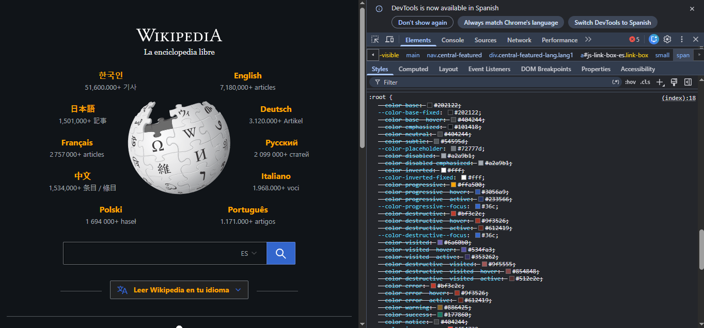
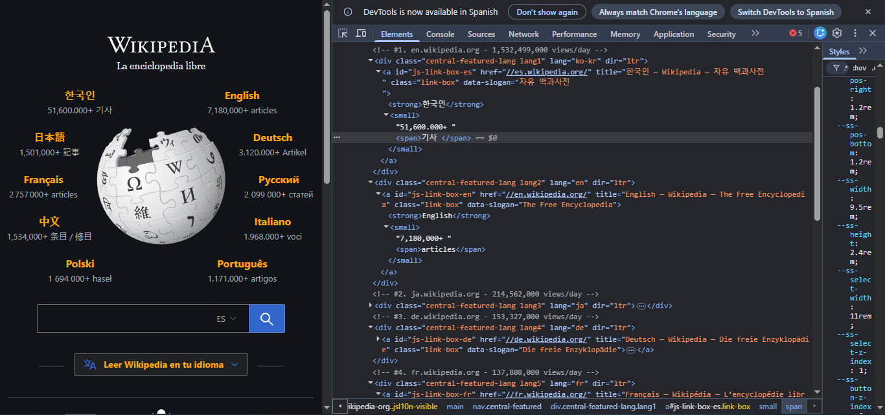
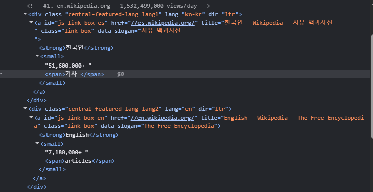
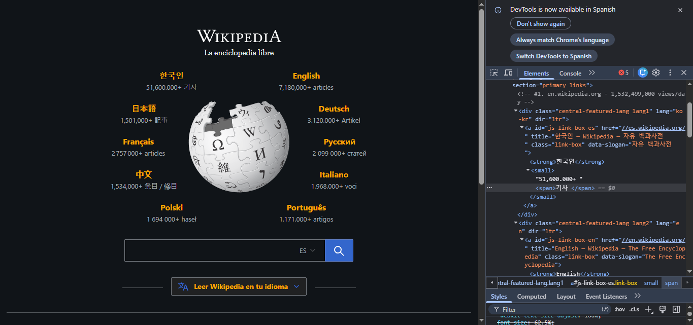
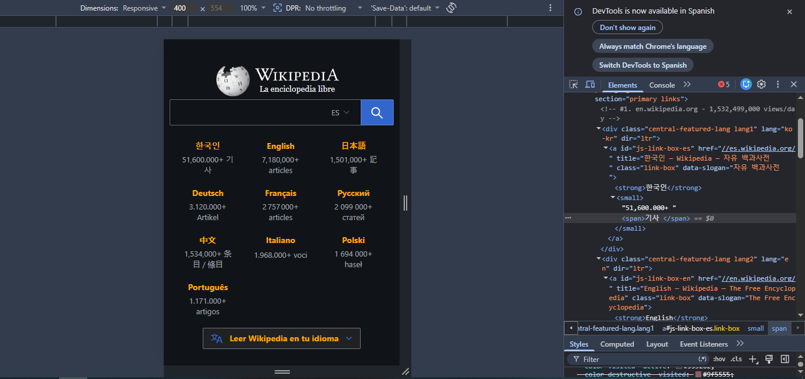
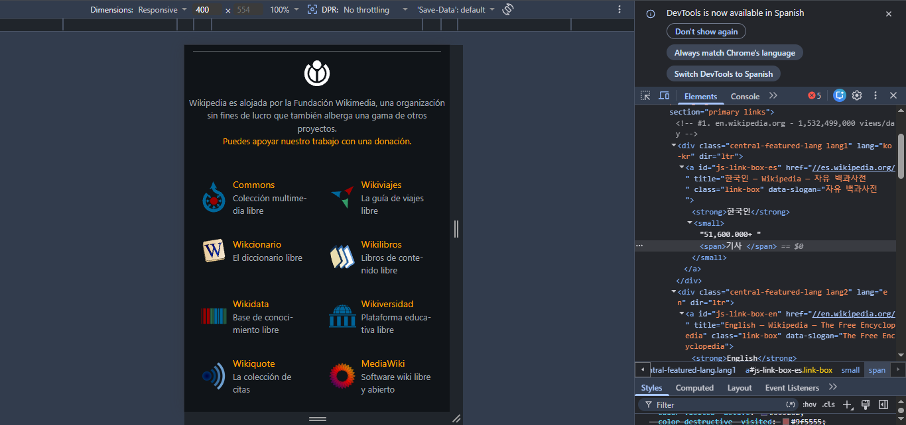
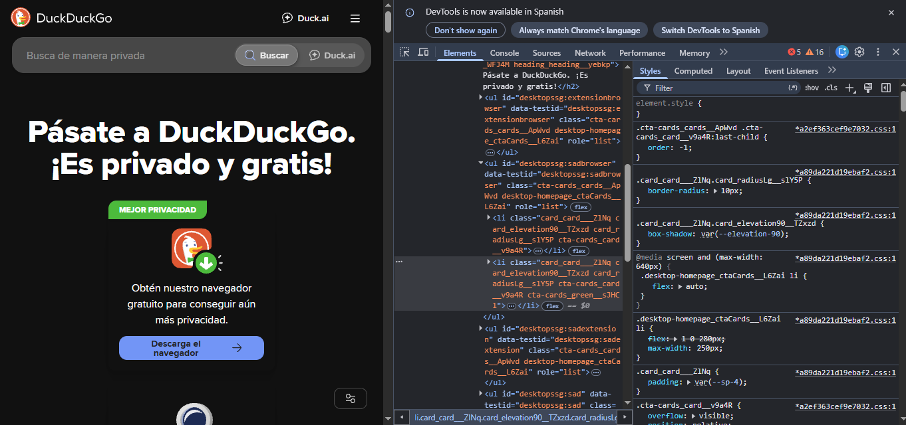
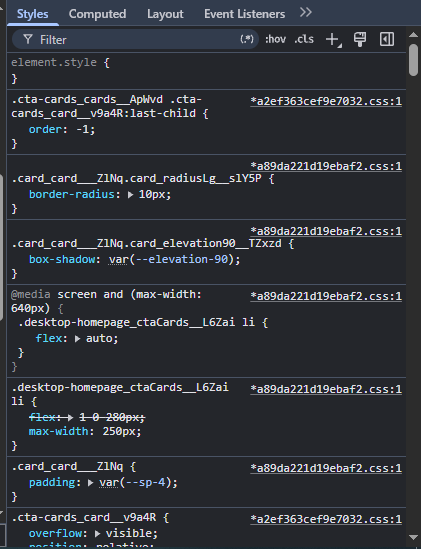

<--! Punto 6!-->

a-R/:

--color-progressive: #ffa500

b-R/:

c-R/:

Los módulos de idioma son bloques HTML reutilizables que combinan estructura (`div`, `a`, `span`), atributos (`class`, `id`, `lang`) y estilos CSS para mostrar y enlazar cada versión lingüística de un sitio web.

d-R/:

Están colocados mediante clases CSS (`lang1`, `lang2`, etc.) que posicionan cada módulo alrededor del logo central usando coordenadas, márgenes o posicionamiento absoluto para formar la distribución circular de idiomas en la portada.

e-R/:

f-R/:

g-R/:

304.68 px de ancho
26 px de alto (contenido)
con 8 px de padding interno.

i-R/:La separación visual entre el input y el botón es de 0 px; ambos elementos están pegados.

ii. ¿Qué tiene de raro esa separación?

ii-R/:Aunque parecen dos elementos distintos, visualmente funcionan como una sola barra continua.
El “espacio” entre ellos no existe realmente: el borde del input y el botón están unidos, por lo que la transición se ve integrada como un único componente.

<-- Punto 7 !-->

R/: 

